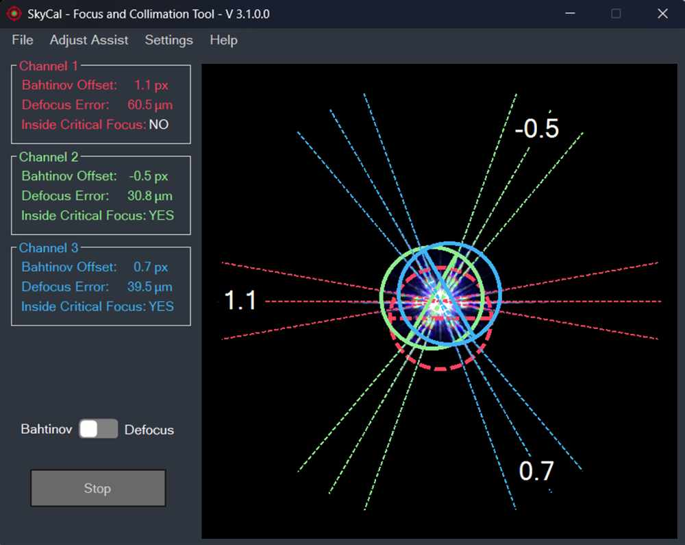
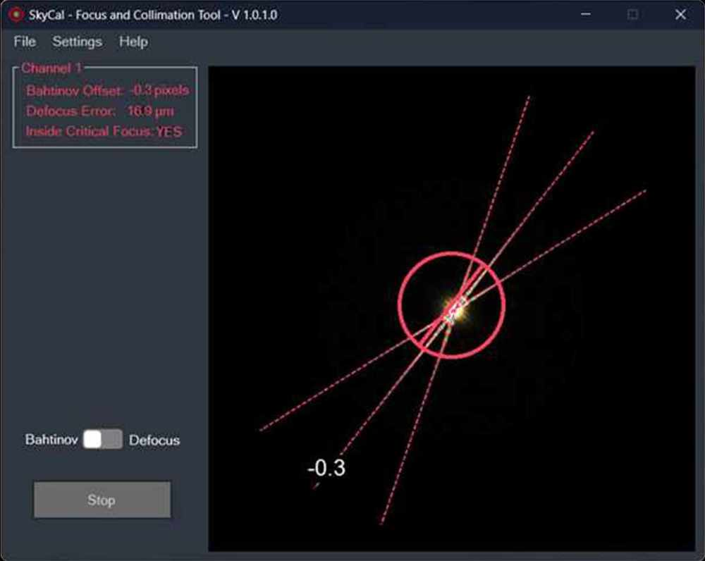
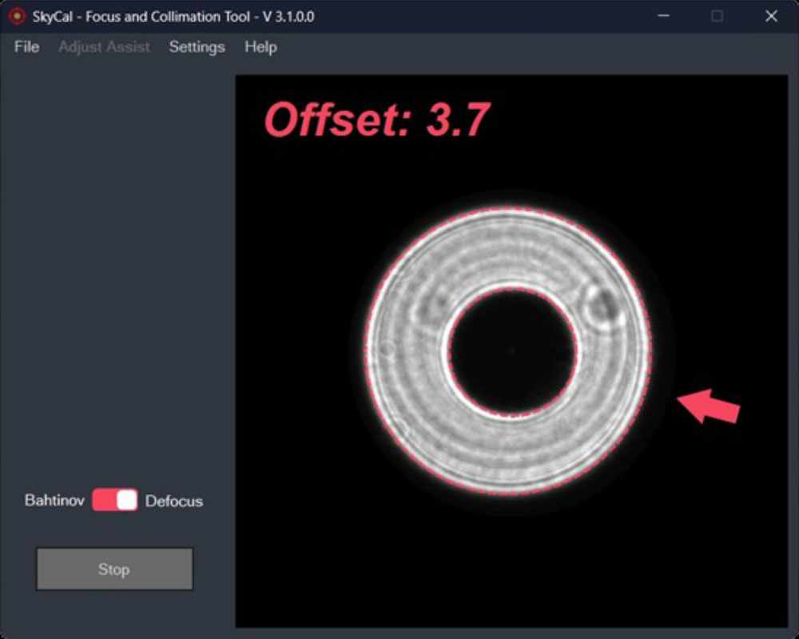

  

<h1 align="center">SkyCal Focus and Collimation Tool</h1>

## 🌌 What is SkyCal?

**SkyCal** is a specialized software tool designed to assist astronomers in achieving **precise focus and collimation** of their telescopes.  
It provides three main functions:

- **Defocused Star Collimation** – for rough collimation, useful as a first step before switching to the Tri-Bahtinov mask for fine tuning  
- **Bahtinov Mask Focusing** – for achieving critical focus on stars, ensuring maximum sharpness in astrophotography  
- **Tri-Bahtinov Mask Collimation** – for fine adjustment of secondary mirrors in SCTs, MCTs, and other reflecting telescopes  

Accurate focus and collimation are essential for astrophotography.  
Even small misalignments in a telescope’s optics can lead to blurred or distorted star images, reduced contrast, and loss of fine detail in deep-sky objects.  

SkyCal provides **visual overlays**, **error measurements**, and **optional voice feedback** to guide adjustments, making the process easier, repeatable, and more reliable.

By integrating SkyCal into your imaging workflow, you can:
- Eliminate guesswork when collimating  
- Achieve repeatable, quantifiable results  
- Improve image quality for both planetary and deep-sky astrophotography  

Whether you are setting up a telescope for the first time or fine-tuning your equipment under the night sky, **SkyCal offers a practical, user-friendly way to keep your optics collimated and focused.**
  

  

  
  

- Click here to download SkyCal setup.exe [Setup](https://github.com/insertnamehere1/Bahtinov-Collimator/releases/download/SetupV3/setup.exe)

- For detailed documentation, please refer to the [User Manual](https://github.com/insertnamehere1/Bahtinov-Collimator/blob/master/help.pdf)

<h1></h1>

## Sponsors

<table style="border: none;">
<tr>
  <td></td>
  <td>Free code signing for this project is provided by <a href="https://about.signpath.io/">SignPath.io</a>, certificate by <a href="https://signpath.org/">SignPath Foundation</a>.</td>
</tr>
</table>
